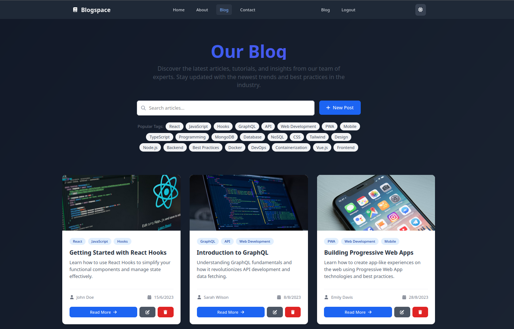

# BlogSpace 🚀

A modern, full-stack blog platform built with React, Node.js, Express, and MongoDB. BlogSpace provides a seamless writing and reading experience with a clean, responsive design and powerful features for both readers and authors.



## ✨ Features

### 🌟 For Readers

- Clean, responsive reading experience
- Dark/Light mode with system preference detection
- Search and filter blog posts
- Categories and tags for easy discovery
- Comments and reactions (coming soon)

### ✍️ For Authors

- Rich text editor with markdown support
- Image upload and management
- Draft and scheduled posts
- Post analytics (coming soon)

### 🔒 User Features

- Secure authentication with JWT
- User profiles with avatars
- Bookmark and save favorite posts
- Personalized recommendations

## 🚀 Tech Stack

### Frontend

- **Framework**: React 19 with Vite
- **Styling**: Tailwind CSS + Flowbite
- **State Management**: React Context API
- **Routing**: React Router v7
- **Form Handling**: React Hook Form
- **Icons**: FontAwesome
- **HTTP Client**: Axios

### Backend

- **Runtime**: Node.js 18+
- **Framework**: Express.js
- **Database**: MongoDB with Mongoose ODM
- **Authentication**: JWT
- **API Documentation**: Swagger/OpenAPI
- **Security**: Helmet, CORS, xss-clean

## 🏗️ Project Structure

```bash
Blog-Website/
├── client/                 # Frontend React application
│   ├── public/            # Static assets
│   └── src/               # Source code
│       ├── components/    # Reusable UI components
│       ├── pages/         # Page components
│       ├── context/       # React context providers
│       └── hooks/         # Custom React hooks
│
├── server/                # Backend Node.js/Express server
│   ├── controllers/       # Route controllers
│   ├── models/           # MongoDB models
│   ├── routes/           # API routes
│   ├── middleware/       # Custom middleware
│   └── utils/            # Utility functions
│
└── README.md             # This file
```

## 🚀 Getting Started

### Prerequisites

- Node.js v18 or higher
- npm v9 or higher
- MongoDB v6.0 or higher

### Installation

1. **Clone the repository**

   ```bash
   git clone https://github.com/ZahaAnass/Blog-Website.git
   cd Blog-Website
   ```

2. **Set up the backend**

   ```bash
   cd server
   cp .env.example .env
   # Update .env with your configuration
   npm install
   npm run dev
   ```

3. **Set up the frontend**

   ```bash
   cd ../client
   npm install
   npm run dev
   ```

4. **Access the application**

   - Frontend: <http://localhost:5173>
   - Backend API: <http://localhost:5000>
   - API Documentation: <http://localhost:5000/api-docs>

## 📚 API Documentation

Interactive API documentation is available at `http://localhost:5000/api-docs` when the server is running.

Key endpoints include:

- Authentication: `POST /api/auth/register`, `POST /api/auth/login`
- Blogs: `GET /api/blogs`, `POST /api/blogs`, `GET /api/blogs/:id`

For complete API documentation, please refer to:

- [Frontend Documentation](./client/README.md)
- [Backend API Documentation](./server/README.md)

## 🛡️ Security

- All passwords are hashed using bcrypt
- Rate limiting on authentication endpoints
- Helmet for secure HTTP headers
- XSS protection
- Input validation and sanitization
- Secure JWT implementation

## 🤝 Contributing

Contributions are welcome! Please follow these steps:

1. Fork the repository
2. Create your feature branch (`git checkout -b feature/AmazingFeature`)
3. Commit your changes (`git commit -m 'Add some AmazingFeature'`)
4. Push to the branch (`git push origin feature/AmazingFeature`)
5. Open a Pull Request

## 🐛 Issues

If you find any issues, please [open an issue](https://github.com/ZahaAnass/Blog-Website/issues) and we'll address it as soon as possible.

## 📄 License

This project is licensed under the MIT License - see the [LICENSE](LICENSE) file for details.

## 🙏 Acknowledgments

- [React](https://reactjs.org/) - Frontend framework
- [Express](https://expressjs.com/) - Backend framework
- [MongoDB](https://www.mongodb.com/) - Database
- [Tailwind CSS](https://tailwindcss.com/) - CSS framework
- [Flowbite](https://flowbite.com/) - UI components
- [FontAwesome](https://fontawesome.com/) - Icons
- [Vite](https://vitejs.dev/) - Build tool
- [Swagger](https://swagger.io/) - API documentation

## 🔗 Project Link

[https://github.com/ZahaAnass/Blog-Website](https://github.com/ZahaAnass/Blog-Website)
